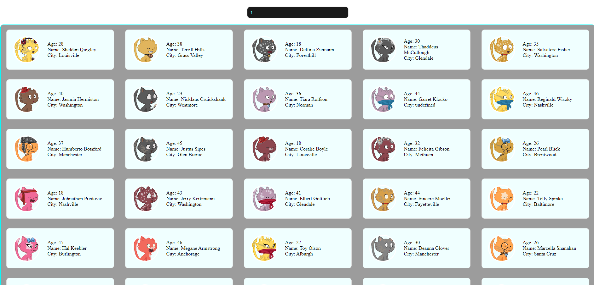

<h2>Развернутый проект search-task</h2>

 *Потестить можно тут* <pre>`https://gennadii87.github.io/public-search-task/`</pre> 

url api `https://dummyjson.com/users/search?q=John`  

 -- <pre>`q=`</pre> параметр запроса, `John` имя запроса

